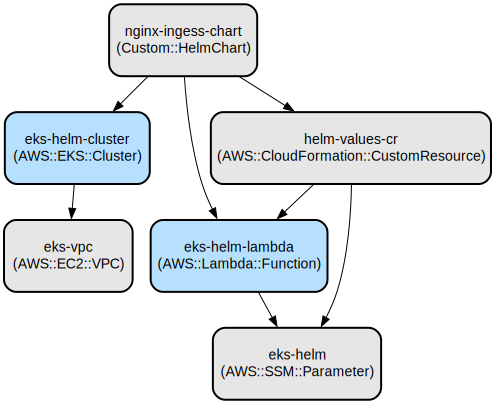

# AWS EKS Cluster Deployment with Dynamic NGINX Ingress Controller Scaling

This project provides an Infrastructure as Code (IaC) solution for deploying an Amazon EKS cluster with environment-aware NGINX Ingress Controller scaling using AWS CDK. It automatically adjusts the number of NGINX Ingress Controller replicas based on the deployment environment (development, staging, or production).

The solution leverages AWS CDK to create and manage the EKS cluster infrastructure while using custom resources to dynamically configure the NGINX Ingress Controller deployment. It provides environment-specific scaling with 1 replica for development and 2 replicas for staging/production environments, ensuring optimal resource utilization and availability based on the deployment context.

Key features include:
- Automated EKS cluster deployment with configurable node capacity
- Dynamic NGINX Ingress Controller scaling based on environment
- Integration with AWS Systems Manager Parameter Store for environment configuration
- Custom IAM role and user mappings for cluster access
- Comprehensive testing framework for configuration validation

## Repository Structure
```
aws/cdk/eks-proj/
├── app.py                         # Main CDK application entry point
├── cdk.json                      # CDK configuration file
├── eks_proj/                     # Core CDK stack implementation
│   └── eks_proj_stack.py        # Main stack defining EKS cluster and resources
├── lambda/                       # Lambda function implementations
│   └── helm_values/             # Helm chart value configuration handler
│       ├── helmval.py           # Environment-based replica count logic
│       └── package/             # Lambda function dependencies
├── tests/                       # Test suite
│   └── unit/                   # Unit tests for Lambda functions
└── requirements.txt            # Python package dependencies
```

## Usage Instructions
### Prerequisites
- AWS CLI configured with appropriate credentials
- Python 3.13 or later
- AWS CDK CLI version 2.201.0 or later
- Docker (for local development)
- kubectl CLI tool

### Installation

1. Clone the repository and set up a virtual environment:
```bash
# Create and activate virtual environment
# Bash:
python -m venv .venv
source .venv/bin/activate  # On Windows use: .venv\Scripts\activate

# PowerShell:
python -m venv .venv
.\.venv\Scripts\Activate.ps1
```

2. Install dependencies:
```bash
# Bash/PowerShell:
pip install -r requirements.txt
```

3. Bootstrap CDK (if not already done in your AWS account):
```bash
# Bash/PowerShell:
cdk bootstrap
```

### Quick Start

1. Deploy the stack:
```bash
# Bash/PowerShell:
cdk deploy
```

2. Verify the deployment:
```bash
# Bash:
aws eks update-kubeconfig --name eks-helm-cluster --region <your-region>
kubectl get pods -n ingress-nginx

# PowerShell:
aws eks update-kubeconfig --name eks-helm-cluster --region $region
kubectl get pods -n ingress-nginx
```

### Cluster Access Configuration

To grant cluster access to users or roles, modify the following placeholders in `eks_proj/eks_proj_stack.py`:
- For IAM users: Replace `USERNAME` with the actual IAM username and uncomment lines 76 - 81
- For IAM roles: Replace `ROLENAME` with the actual IAM role name and uncomment lines 84 - 89

You can modify the environment directly in the CDK stack code by updating the `string_value` parameter in `eks_proj/eks_proj_stack.py`:
```python
ssm_env_para = ssm.StringParameter(self, 'eks-helm',
                                  parameter_name='/platform/account/env',
                                  string_value='development'  # Change to 'staging' or 'production'
                                  )
```
- 'deleopment' will create 1 ingress-nginx pod.
- 'staging' will create 2 ingress-nginx pods.
- 'production' will create 2 ingress-nginx pods.

If any other value than 'development', 'staging' or 'production' is provided as the ssm paramter value, the ingress-nginx pod count will be 0. 

2. Check NGINX Ingress Controller replicas:
```bash
# Bash/PowerShell:
kubectl get deployment -n ingress-nginx ingress-nginx-controller
```

### Troubleshooting

1. EKS Cluster Access Issues
- Problem: Unable to access EKS cluster
- Solution: Verify IAM permissions and run:
```bash
# Bash:
aws eks get-token --cluster-name eks-helm-cluster

# PowerShell:
aws eks get-token --cluster-name eks-helm-cluster
```

2. NGINX Ingress Controller Deployment Issues
- Problem: Ingress controller pods not starting
- Solution: Check events and logs:
```bash
# Bash/PowerShell:
kubectl describe pods -n ingress-nginx
kubectl logs -n ingress-nginx deployment/ingress-nginx-controller
```

## Data Flow
The solution implements an environment-aware configuration flow for EKS cluster resources.

```ascii
[SSM Parameter Store] --> [Lambda Function] --> [Custom Resource] --> [Helm Chart] --> [EKS Cluster]
     (env value)           (replica logic)      (configuration)      (deployment)     (execution)
```

Component interactions:
1. SSM Parameter Store holds the environment configuration
2. Lambda function reads the environment and determines replica count
3. Custom Resource triggers configuration updates
4. Helm chart applies the configuration to the cluster
5. EKS cluster maintains the desired state

## Infrastructure



### VPC Resources
- VPC with 2 availability zones (CIDR: 172.18.0.0/16)

### EKS Resources
- EKS Cluster (eks-helm-cluster)
  - Kubernetes version: 1.32
  - Instance type: t3a.medium
  - Default capacity: 2 nodes

### Lambda Resources
- Function: eks-helm-lambda
  - Runtime: Python 3.13
  - Handler: helmval.handler
  - Purpose: Manages Helm chart values based on environment

### IAM Resources
- User mapping: USERNAME → system:masters
- Role mapping: ROLENAME → system:masters

### SSM Resources
- Parameter: /platform/account/env
  - Type: String
  - Default value: development